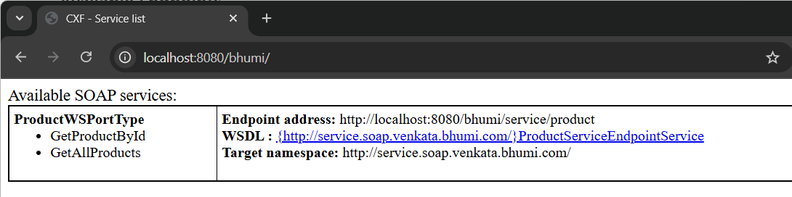
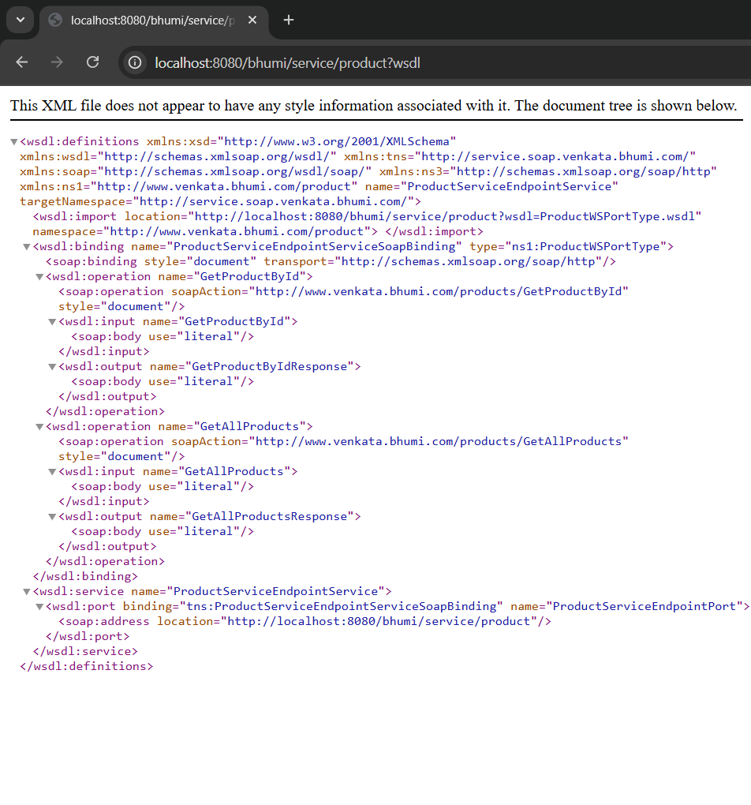

# SOAP Modernization Using Apache CXF and Spring Boot

This project demonstrates a solution for SOAP service modernization using Apache CXF integrated with Spring Boot. It specifically addresses issues with legacy JAX-RPC style SOAP services that include output parameters in the request.

## 🚀 Problem Statement

Traditional JAX-RPC SOAP services often include output parameters directly in the request.

Modern Spring Boot web services using Spring Web Services or Spring Boot's built-in SOAP support do not support this.

This creates challenges during SOAP modernization or migration.

## 🚧 Additional Security Challenge
The application should meet the following security requirements:

Restrict Anonymous Access: Ensure that only authenticated users can access the SOAP services.

Enforce UsernameToken Policy: Implement WS-Security using the UsernameToken policy to authenticate users and secure communication.

## ✅ Solution Approach

Used Apache CXF to provide SOAP service support with better compatibility for JAX-RPC style services.

Integrated CXF with Spring Boot to handle SOAP requests with output parameters.

Delivered a seamless modernization path without requiring changes to existing SOAP clients.

## 🛠️ Technologies Used

* Spring Boot
* Apache CXF
* Java 17
* SOAP Web Services
* Docker (Optional for deployment)

## ▶️ Usage
To access the available endpoints, use the following URL:

```bash
http://localhost:8080/bhumi/
```
**Note:**

- The application is running on port 8080 (as configured in the application.properties file). 
- The context path is set to /bhumi (configured via cxf.path).

Make sure to replace localhost with your server's IP or domain if you're running the application on a different machine.



**Service Methods**
This service exposes two methods:

- GetProductById – Retrieves a product by its ID.
- GetAllProducts – Retrieves a list of all products.

You can view the WSDL (Web Services Description Language) by clicking on the WSDL link.



## 🔧 Testing

Tip: I used [Wizdler](https://chromewebstore.google.com/detail/wizdler/oebpmncolmhiapingjaagmapififiakb?hl=en)  extension to discover and test the available operations and input parameters.

We can test this service by using Postman or SOAPUI.

### GetAllProductsRequest
URL: http://localhost:8080/bhumi/service/product
```xml
<soapenv:Envelope xmlns:soapenv="http://schemas.xmlsoap.org/soap/envelope/" xmlns:prod="http://www.venkata.bhumi.com/product">
   <soapenv:Header>
    <wsse:Security xmlns:wsse="http://docs.oasis-open.org/wss/2004/01/oasis-200401-wss-wssecurity-secext-1.0.xsd" xmlns="http://docs.oasis-open.org/wss/2004/01/oasis-200401-wss-wssecurity-secext-1.0.xsd" soapenv:mustUnderstand="1">
         <wsse:UsernameToken xmlns:wsu="http://docs.oasis-open.org/wss/2004/01/oasis-200401-wss-wssecurity-utility-1.0.xsd"  wsu:Id="XWSSGID-1272659251049-1841441677" xmlns:wsse="http://docs.oasis-open.org/wss/2004/01/oasis-200401-wss-wssecurity-secext-1.0.xsd" xmlns="http://docs.oasis-open.org/wss/2004/01/oasis-200401-wss-wssecurity-secext-1.0.xsd">
            <wsse:Username>venkata</wsse:Username>
            <wsse:Password Type="http://docs.oasis-open.org/wss/2004/01/oasis-200401-wss-username-token-profile-1.0#PasswordText">bhumi</wsse:Password>
         </wsse:UsernameToken>
   </wsse:Security>
      </soapenv:Header>
      <soapenv:Body>
        <GetAllProductsRequest xmlns="http://www.venkata.bhumi.com/product/types/"/>
   </soapenv:Body>
</soapenv:Envelope>
```
### ProductByIdRequest:
```xml
<soapenv:Envelope xmlns:soapenv="http://schemas.xmlsoap.org/soap/envelope/" xmlns:prod="http://www.venkata.bhumi.com/product">
   <soapenv:Header>
    <wsse:Security xmlns:wsse="http://docs.oasis-open.org/wss/2004/01/oasis-200401-wss-wssecurity-secext-1.0.xsd" xmlns="http://docs.oasis-open.org/wss/2004/01/oasis-200401-wss-wssecurity-secext-1.0.xsd" soapenv:mustUnderstand="1">
         <wsse:UsernameToken xmlns:wsu="http://docs.oasis-open.org/wss/2004/01/oasis-200401-wss-wssecurity-utility-1.0.xsd"  wsu:Id="XWSSGID-1272659251049-1841441677" xmlns:wsse="http://docs.oasis-open.org/wss/2004/01/oasis-200401-wss-wssecurity-secext-1.0.xsd" xmlns="http://docs.oasis-open.org/wss/2004/01/oasis-200401-wss-wssecurity-secext-1.0.xsd">
            <wsse:Username>venkata</wsse:Username>
            <wsse:Password Type="http://docs.oasis-open.org/wss/2004/01/oasis-200401-wss-username-token-profile-1.0#PasswordText">bhumi</wsse:Password>
         </wsse:UsernameToken>
   </wsse:Security>
      </soapenv:Header>
   <soapenv:Body>
        <prod:productId>11</prod:productId>
   </soapenv:Body>
</soapenv:Envelope>
```

#### Response:
```xml
<soap:Envelope xmlns:soap="http://schemas.xmlsoap.org/soap/envelope/">
    <soap:Body>
        <ns2:product xmlns="http://www.venkata.bhumi.com/product/types/" xmlns:ns2="http://www.venkata.bhumi.com/product">
            <id>11</id>
            <title>Annibale Colombo Bed</title>
            <description>The Annibale Colombo Bed is a luxurious and elegant bed frame, crafted with high-quality materials for a comfortable and stylish bedroom.</description>
            <price>1899.99</price>
            <discountPercentage>0.29</discountPercentage>
            <rating>4.14</rating>
            <stock>47</stock>
            <brand>Annibale Colombo</brand>
            <category>furniture</category>
            <thumbnail>https://cdn.dummyjson.com/products/images/furniture/Annibale%20Colombo%20Bed/thumbnail.png</thumbnail>
            <returnPolicy>7 days return policy</returnPolicy>
            <minimumOrderQuantity>1</minimumOrderQuantity>
            <tags>furniture</tags>
            <tags>beds</tags>
            <weight>3</weight>
            <dimensions>
                <width>28.75</width>
                <height>26.88</height>
            </dimensions>
            <reviews>
                <reviewerName>Julian Newton</reviewerName>
                <reviewerEmail>julian.newton@x.dummyjson.com</reviewerEmail>
                <date>2024-05-23T08:56:21.620Z</date>
                <rating>4</rating>
                <comment>Great value for money!</comment>
            </reviews>
            <reviews>
                <reviewerName>Madison Collins</reviewerName>
                <reviewerEmail>madison.collins@x.dummyjson.com</reviewerEmail>
                <date>2024-05-23T08:56:21.620Z</date>
                <rating>5</rating>
                <comment>Would buy again!</comment>
            </reviews>
            <reviews>
                <reviewerName>Clara Berry</reviewerName>
                <reviewerEmail>clara.berry@x.dummyjson.com</reviewerEmail>
                <date>2024-05-23T08:56:21.620Z</date>
                <rating>4</rating>
                <comment>Would buy again!</comment>
            </reviews>
            <warrantyInformation>2 year warranty</warrantyInformation>
            <shippingInformation>Ships overnight</shippingInformation>
            <availabilityStatus>In Stock</availabilityStatus>
            <images>https://cdn.dummyjson.com/products/images/furniture/Annibale%20Colombo%20Bed/1.png</images>
            <images>https://cdn.dummyjson.com/products/images/furniture/Annibale%20Colombo%20Bed/2.png</images>
            <images>https://cdn.dummyjson.com/products/images/furniture/Annibale%20Colombo%20Bed/3.png</images>
            <meta>
                <createdAt>2024-05-23T08:56:21.620Z</createdAt>
                <updatedAt>2024-05-23T08:56:21.620Z</updatedAt>
                <barcode>7113807059215</barcode>
                <qrCode>https://assets.dummyjson.com/public/qr-code.png</qrCode>
            </meta>
        </ns2:product>
    </soap:Body>
</soap:Envelope>
```


